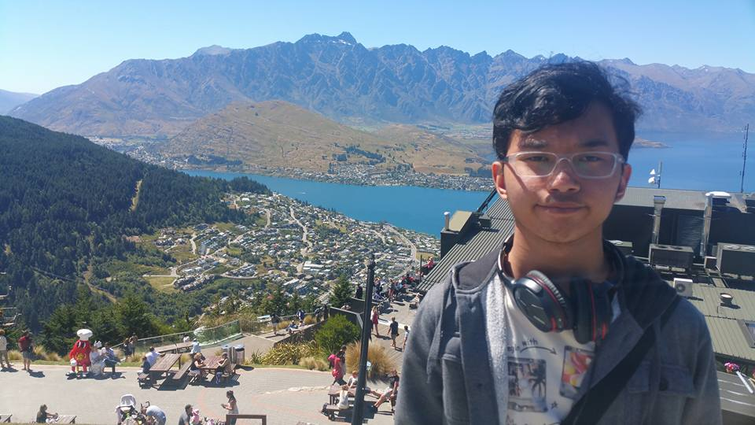

# Hi, I'm _leinadalrus_!

Well o well, I guess I’m interested in programming web-apps, apps, and game apps!

I wanted to make giant robots, but I settled with programming 'em instead after watching Gundam Destiny as a kid.

And if you wanna know: 

#### Full-stack:

 

- `transpoint` Spring Boot and Vue web-app in tandem formerly with `gearflat` but now used with `gear-pont`
- `gear-pont` a Vue and Node.js based web-app for harbouring data for my recreational use and obsession with rotating objects that go at high speeds!
- `gearflat` Small-scale web-app project for practicing Vue3 with TypeScript. Developing a web-app for my hobby paraphernalia.

 

#### Software Development

 

- `Mirage-Works` is an experimental ECU/TCU embedded software diagnostics, logging and manager tool
- `rubberaccel` the mobile-app variant of `gearflat`/`levelate`

 

#### Game Development

- `spunbacc` - Ray Tracer Challenge project for creating a Ray Tracer software for game development

 

Contact: How to reach me ... just hit me up on daniel.david.surla@gmail.com, I tend to check my emails every two days or so.

*P.S*
  *Thanks for reading this!*
<!---
leinadalrus/leinadalrus is a ✨ special ✨ repository because its `README.md` (this file) appears on your GitHub profile.
You can click the Preview link to take a look at your changes.
--->
