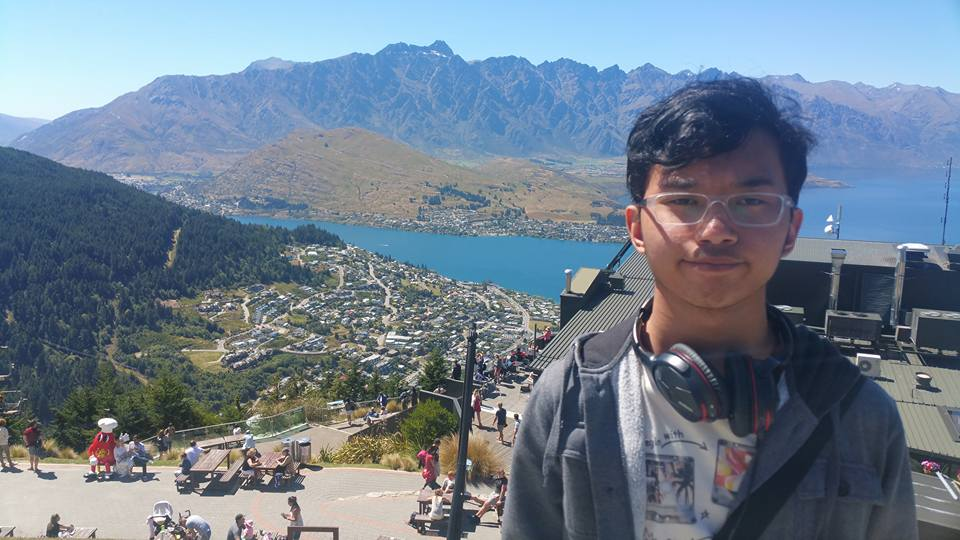

# Hi, I'm _Daniel Surla_!

Well o well, I guess I’m interested in programming web apps, toolings, and video games!

I became a programmer because I wanted to make giant robots, but I settled with programming them instead after watching Gundam Destiny as a kid.
I was also supposed to become a Chemical Engineer like my mother ... but programming gives me more time for fun and self-development.

And if you wanna know what project I've been doing or have done:

#### Full-stack:

 

- Proprietary and Internal Systems projects of Maytronics Australia, (_cannot disclose ..._)
- `Magnolia` - SvelteKit demo website for Inventory Management and Customer Relationship Systems

 

#### Software Development

 

- `glint` - Tamiya Mini4WD, small-scale video game written in Rust
- `arcadian` - Small and basic Tracker DAW, written in Rust

 

Contact: How to reach me ... just hit me up on daniel.david.surla@gmail.com, I tend to check my emails every two days or so.

*P.S*
*Thanks for reading this!*

<!---
leinadalrus/leinadalrus is a ✨ special ✨ repository because its `README.md` (this file) appears on your GitHub profile.
You can click the Preview link to take a look at your changes.
--->
